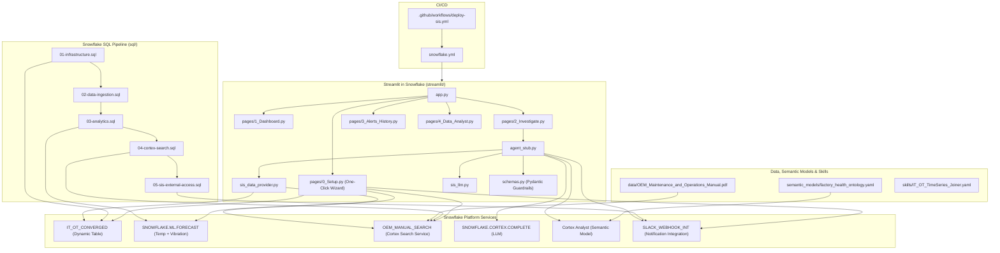
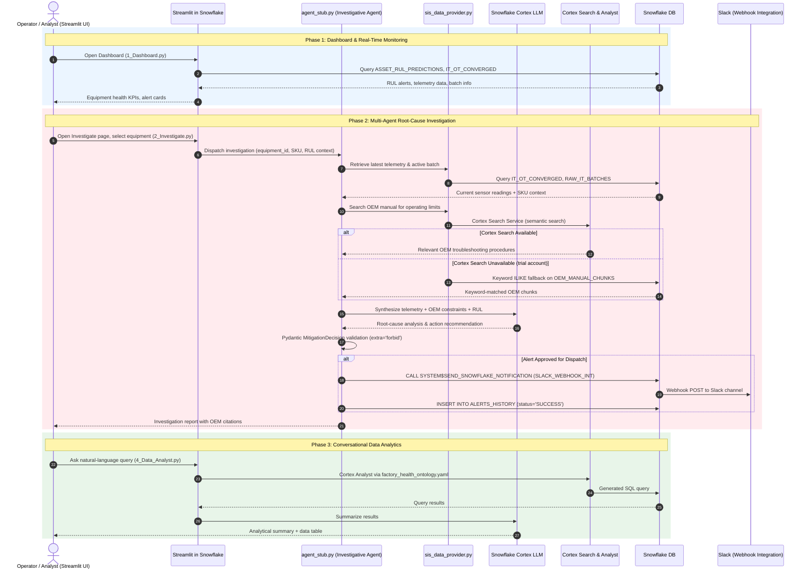
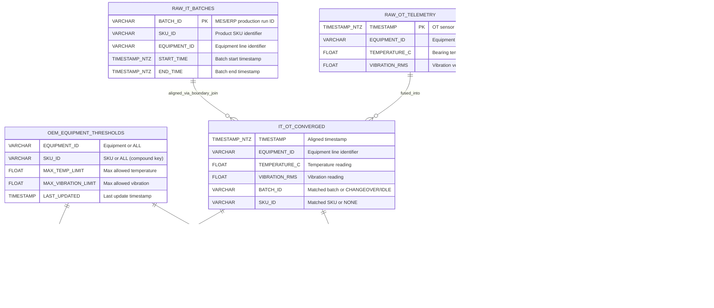

# SKU-Specific OEE Degradation Tracker

A Snowflake-native prototype that converges high-frequency OT sensor streams with low-frequency IT batch schedules to identify which product runs are destroying machine health and autonomously mitigates the risk via Slack.

The system integrates a Snowflake SQL data pipeline, RAG over OEM maintenance manuals, ML forecasting, SKU-aware threshold resolution, Pydantic-guardrailed multi-agent orchestration, and a multi-page Streamlit UI deployed **inside Snowflake (Streamlit in Snowflake)** via GitHub Actions CI/CD.

---

## 1. Problem Statement

Manufacturing plants suffer from persistent unplanned downtime because physical machine telemetry (OT) and enterprise business logic (IT) operate in isolated silos. When a critical asset degrades, reliability engineers observe the physical symptoms (escalating vibration or temperature) but lack the operational context: which product was running, which batch caused the spike, or what material was being processed.

This disconnect prevents factories from identifying the true root cause of equipment fatigue. Plants experience recurring "micro-stoppages" and accelerated wear that destroy OEE because machinery is blindly treated for mechanical failure rather than being optimized for the specific product mix causing the stress.

---

## 2. Solution

The SKU-Specific OEE Degradation Tracker is a Snowflake-native prototype that:

- **Converges** high-frequency OT sensor telemetry with low-frequency IT batch schedules via a Dynamic Table with 1-minute lag (`IT_OT_CONVERGED`)
- **Predicts** asset Remaining Useful Life (RUL) using `SNOWFLAKE.ML.FORECAST` over a 72-hour temperature and vibration trajectory
- **Resolves SKU-specific OEM thresholds** via a 3-tier lookup: (equipment+SKU) > (equipment+ALL) > (ALL+ALL), sourced from `OEM_EQUIPMENT_THRESHOLDS`
- **Investigates** root causes by extracting OEM equipment limits from unstructured manuals via Cortex Search Service (semantic search), with keyword ILIKE fallback
- **Mitigates** automatically -- posts structured Slack alerts via Snowflake Webhook Notification Integration (`SYSTEM$SEND_SNOWFLAKE_NOTIFICATION`)
- **Deploys to Snowflake** via GitHub Actions CI/CD with OIDC authentication

---

## 3. Challenge Rubric Alignment

| Criterion | Implementation |
|---|---|
| **IT/OT Convergence** | Dynamic Table `IT_OT_CONVERGED` (1-min lag) via `TIMESTAMP BETWEEN START_TIME AND END_TIME` boundary join (`sql/01-infrastructure.sql`) |
| **Predict Failures & Root Cause** | `SNOWFLAKE.ML.FORECAST` (72-hr trajectory) + SKU-aware `ASSET_RUL_PREDICTIONS` view with 3-tier OEM threshold resolution (`sql/03-analytics.sql`) |
| **Command Center & Action** | 5-page Streamlit app: Setup Wizard, Dashboard, Investigative Agent chat, Alerts History, Data Analyst (Cortex Analyst) |
| **Synthetic Data** | Pure SQL data generation via `GENERATOR()` + `UNIFORM()` in the one-click Setup Wizard (`streamlit/pages/0_Setup.py`) -- 5 equipment lines, 3 SKUs, 7 days |
| **Semantic Model & Ontology** | `semantic_models/factory_health_ontology.yaml` -- Cortex Analyst semantic view linking assets, batches, and RUL predictions |
| **Unstructured Processing** | `data/OEM_Maintenance_and_Operations_Manual.pdf` parsed via `SNOWFLAKE.CORTEX.PARSE_DOCUMENT`, chunked into `OEM_MANUAL_CHUNKS`, indexed by Cortex Search Service (`sql/04-cortex-search.sql`) |
| **Reusable Skill** | `skills/IT_OT_TimeSeries_Joiner.yaml` + `.cortex/skills/it-ot-timeseries-joiner/SKILL.md` -- native CoCo Skill for the time-series boundary join |
| **Slack Integration** | Snowflake Webhook Notification Integration via `SYSTEM$SEND_SNOWFLAKE_NOTIFICATION` (`sql/05-sis-external-access.sql`) -- works on all account types including trial |
| **Multi-Agent Orchestration** | Investigative Agent -> Cortex LLM -> Pydantic-validated (`extra='forbid'`) schema defense -> Slack webhook dispatch |
| **CI/CD** | GitHub Actions with OIDC auth -> `snow streamlit deploy` (`.github/workflows/deploy-sis.yml`) |
| **Test Suite** | Schema guardrails + Snowflake live data validation (`tests/test_oee_tracker.py`) |

---

## Core Capabilities

* **IT/OT Time-Series Boundary Join:** LEFT JOIN with BETWEEN predicate aligns 1-minute OT sensor readings to IT batch windows, with COALESCE handling idle/changeover periods.
* **SKU-Specific OEM Thresholds:** `OEM_EQUIPMENT_THRESHOLDS` uses a compound `(EQUIPMENT_ID, SKU_ID)` key, enabling per-SKU breach detection (e.g., LINE-2-PACKAGING + SKU-899 -> 82 degC / 4.2 mm/s).
* **OEM Manual RAG Pipeline:** Parses PDF maintenance documentation via `SNOWFLAKE.CORTEX.PARSE_DOCUMENT` in LAYOUT mode, chunks text with overlap, and indexes via Cortex Search Service for semantic retrieval.
* **Dual OEM Search Strategy:** Cortex Search Service (semantic) as primary, keyword ILIKE as fallback -- graceful degradation on trial accounts where Cortex Search may be unavailable.
* **Pydantic Schema Defense:** `DiagnosticState`, `OEMValidation`, and `MitigationDecision` schemas enforce strict validation with `extra='forbid'` to prevent LLM hallucination in agent handoffs.
* **Snowflake-Native Slack Alerts:** Uses `SYSTEM$SEND_SNOWFLAKE_NOTIFICATION` with a Webhook Notification Integration -- no External Access Integration required, works on trial accounts.
* **One-Click Setup Wizard:** In-app setup page (`0_Setup.py`) creates all infrastructure, generates synthetic data, trains ML models, and configures the pipeline -- no manual SQL execution required. Fully idempotent.
* **Automated CI/CD:** GitHub Actions deploys infrastructure SQL, uploads OEM PDF + semantic model to stages, and deploys the Streamlit app on every push to main. Account-agnostic via `${{ vars.SNOWFLAKE_ACCOUNT }}`.

---

## System Architecture



---

## Multi-Agent Orchestration Sequence

The following sequence diagram illustrates how the Streamlit UI, investigative agent, Snowflake Cortex services, and Slack webhook interact across on-demand investigation and alert dispatch paths:



---

## Database Schema (Entity-Relationship Diagram)

The Snowflake data layer (`sql/01-infrastructure.sql` through `sql/04-cortex-search.sql`) unifies IT production schedules, high-frequency OT machine telemetry, SKU-level OEE analytical aggregations, predictive anomaly outputs, and Cortex Search RAG document chunks:



---

## Repository Structure

```text
|-- cortex/
|   -- skills/
|       -- it-ot-timeseries-joiner/
|           -- SKILL.md                   # Native CoCo Skill for IT/OT boundary join
|-- .github/
|   -- workflows/
|       -- deploy-sis.yml                 # GitHub Actions CI/CD: OIDC -> deploy SiS
|-- cortex_project/
|   -- cortex-project.yaml                # Cortex project definition
|   -- factory_health_ontology.sv.yaml    # Semantic view definition
|-- data/
|   -- OEM_Maintenance_and_Operations_Manual.pdf
|-- semantic_models/
|   -- factory_health_ontology.yaml       # Cortex Analyst semantic model
|-- skills/
|   -- IT_OT_TimeSeries_Joiner.yaml       # Skill definition artifact
|-- sql/
|   -- 01-infrastructure.sql              # DB, schema, tables, dynamic table, stages
|   -- 02-data-ingestion.sql              # COPY INTO + DT refresh
|   -- 03-analytics.sql                   # Views, ML forecasts, SKU-aware RUL predictions
|   -- 04-cortex-search.sql               # Cortex Search Service on OEM chunks
|   -- 05-sis-external-access.sql         # Slack webhook notification integration
|-- streamlit/                             # SiS deployment (Snowpark + Cortex only)
|   -- .streamlit/config.toml
|   -- agent_stub.py                      # Cortex LLM agent + Slack via webhook notification
|   -- app.py                             # Entry point (auto-detects if setup is needed)
|   -- environment.yml                    # Anaconda dependencies for SiS
|   -- schemas.py                         # Pydantic guardrails (DiagnosticState, OEMValidation, MitigationDecision)
|   -- sis_data_provider.py               # Session-based data provider (Cortex Search + ILIKE fallback)
|   -- sis_llm.py                         # Cortex-only LLM (SNOWFLAKE.CORTEX.COMPLETE)
|   -- snowflake_conn.py                  # get_active_session() wrapper
|   -- pages/
|       -- 0_Setup.py                     # One-click infrastructure setup wizard
|       -- 1_Dashboard.py                 # RUL alerts + converged telemetry grid
|       -- 2_Investigate.py               # Agent chat + Slack webhook dispatch
|       -- 3_Alerts_History.py            # Audit log
|       -- 4_Data_Analyst.py              # Cortex Analyst playground
|-- tests/
|   -- test_oee_tracker.py                # Schema guardrails + Snowflake live data validation
|-- snowflake.yml                          # Snow CLI project definition for SiS deploy
|-- README.md
|-- .gitignore
```

---

## Snowflake Objects

| Object | Type | Description |
|--------|------|-------------|
| `OEE_COMMAND_CENTER` | Database | Top-level container |
| `FACTORY_FLOOR` | Schema | All operational objects |
| `RAW_IT_BATCHES` | Table | IT batch schedule (BATCH_ID, SKU_ID, EQUIPMENT_ID, START_TIME, END_TIME) |
| `RAW_OT_TELEMETRY` | Table | OT sensor readings at 1-min frequency (TIMESTAMP, EQUIPMENT_ID, TEMPERATURE_C, VIBRATION_RMS) |
| `IT_OT_CONVERGED` | Dynamic Table | Fused IT+OT via boundary join (1-min target lag) |
| `OEM_EQUIPMENT_THRESHOLDS` | Table | SKU-specific operating limits (EQUIPMENT_ID + SKU_ID compound key) |
| `OEM_MANUAL_CHUNKS` | Table | Chunked OEM manual text for RAG retrieval |
| `ALERTS_HISTORY` | Table | Mitigation audit log |
| `V_EQUIPMENT_TEMP_HISTORY` | View | Hourly avg temperature by equipment |
| `V_EQUIPMENT_VIBE_HISTORY` | View | Hourly avg vibration by equipment |
| `EQUIPMENT_TEMP_FORECAST` | ML Forecast | Per-equipment temperature forecast model |
| `EQUIPMENT_VIBE_FORECAST` | ML Forecast | Per-equipment vibration forecast model |
| `PREDICTED_TEMPERATURES` | Table | 72-hour temperature forecast output |
| `PREDICTED_VIBRATIONS` | Table | 72-hour vibration forecast output |
| `ASSET_RUL_PREDICTIONS` | View | Predicted failure time + RUL per equipment (SKU-aware thresholds) |
| `OEM_MANUAL_SEARCH` | Cortex Search Service | Semantic search over OEM chunks |
| `FACTORY_DATA_STAGE` | Stage | CSV data upload |
| `OEM_MANUALS_STAGE` | Stage | OEM PDF storage (SSE encrypted) |
| `SEMANTIC_MODELS_STAGE` | Stage | Cortex Analyst YAML + Streamlit app files |
| `SLACK_WEBHOOK_SECRET` | Secret | Slack webhook secret (path portion of URL) |
| `SLACK_WEBHOOK_INT` | Notification Integration | Webhook integration for Slack alerts (works on all account types) |

---

## Getting Started

### Prerequisites

- Snowflake account (trial, standard, or enterprise)
- `ACCOUNTADMIN` role access
- GitHub repository with this code
- (Optional) Slack Incoming Webhook URL for alert notifications

### Option A: Streamlit in Snowflake (Recommended)

This is the fastest path. The app includes a built-in **Setup Wizard** that creates all infrastructure, generates synthetic data, trains ML models, and configures the pipeline -- all from a single button click inside Snowflake.

#### 1. Create OIDC Service User in Snowflake

Run this SQL in your Snowflake account, replacing `<owner>/<repo>` with your GitHub repository:

```sql
USE ROLE ACCOUNTADMIN;

CREATE WAREHOUSE IF NOT EXISTS COMPUTE_WH
  WAREHOUSE_SIZE = 'XSMALL'
  AUTO_SUSPEND = 60
  AUTO_RESUME = TRUE;

CREATE USER IF NOT EXISTS SVC_GITHUB_ACTIONS
  TYPE = SERVICE
  DEFAULT_ROLE = ACCOUNTADMIN
  WORKLOAD_IDENTITY = (
    TYPE = OIDC
    ISSUER = 'https://token.actions.githubusercontent.com'
    SUBJECT = 'repo:<owner>/<repo>:ref:refs/heads/main'
  );
GRANT ROLE ACCOUNTADMIN TO USER SVC_GITHUB_ACTIONS;
```

#### 2. Configure GitHub Repository Variable

Go to **Settings -> Secrets and variables -> Actions -> Variables** and add:

| Name | Value |
|---|---|
| `SNOWFLAKE_ACCOUNT` | Your account identifier (e.g., `ORGNAME-ACCTNAME`) |

#### 3. (Optional) Configure Slack Webhook

Add Snowflake account identifier via Github `${{ vars.SNOWFLAKE_ACCOUNT }}

Edit `sql/05-sis-external-access.sql` and replace `<YOUR_WEBHOOK_SECRET>` with the secret portion of your Slack Incoming Webhook URL (everything after `https://hooks.slack.com/services/`).

#### 4. Push to Main

GitHub Actions automatically:
1. Authenticates via OIDC to your Snowflake account
2. Creates infrastructure (tables, stages, dynamic table)
3. Uploads OEM PDF and semantic model YAML to stages
4. Sets up Slack webhook notification integration
5. Deploys the Streamlit app

#### 5. Open the App

Open Snowsight -> Streamlit -> `OEE_COMMAND_CENTER_APP`

The home page will show a warning: *"Infrastructure not yet deployed."*

#### 6. Run the Setup Wizard

Navigate to the **Setup** page in the sidebar and click **Deploy Infrastructure**. The wizard runs 8 phases automatically:

| Phase | What it does |
|-------|-------------|
| 1 | Creates database, schema, tables, dynamic table, stages |
| 2 | Generates ~50K OT telemetry rows + ~210 IT batch records (pure SQL) |
| 3 | Refreshes the dynamic table |
| 4 | Inserts SKU-specific OEM thresholds |
| 5 | Parses OEM PDF and chunks it (if PDF is on stage) |
| 6 | Creates Cortex Search Service (skips gracefully if unavailable) |
| 7 | Trains ML forecast models + generates 72-hour predictions + RUL view |
| 8 | Checks Slack webhook integration status |

Each phase is idempotent -- re-running skips phases that already completed.

#### 7. Navigate to Dashboard

Once setup completes, go to the **Dashboard** page to see live RUL predictions and converged telemetry data.

### Option B: Manual Deployment (No CI/CD)

If you prefer not to use GitHub Actions, deploy directly via Snow CLI:

```bash
snow streamlit deploy --replace
```

Then open the app in Snowsight and use the **Setup** page to provision everything.

---

## Running Tests

```bash
# Set connection (either via env var or .env)
export SNOWFLAKE_CONNECTION_NAME=<your-connection>

python -m pytest tests/test_oee_tracker.py -v
```

Tests cover:
- Pydantic schema guardrails (7 tests) -- validates DiagnosticState, OEMValidation, MitigationDecision
- Snowflake live data validation (7 tests) -- thresholds, RUL predictions, IT/OT join parity, ML models, webhook integration

---

## CoCo CLI Integration

The project includes a native CoCo skill at `.cortex/skills/it-ot-timeseries-joiner/SKILL.md` that CoCo auto-discovers when working in this project directory. It enables CoCo to apply the IT/OT boundary-join pattern on demand.

The project-root `.mcp.json` configures three CoCo CLI MCP servers: Slack for mitigation alert dispatch, memory for persistent diagnostic and mitigation state, and filesystem access to project files. Set `SLACK_BOT_TOKEN` and `SLACK_TEAM_ID` in the environment before starting CoCo CLI to enable Slack; do not put credentials in the config file. The filesystem server is scoped to the project directory from which CoCo CLI is launched.

---

## Architecture Notes

### SKU-Specific Threshold Resolution

The `ASSET_RUL_PREDICTIONS` view uses a 3-tier COALESCE lookup against `OEM_EQUIPMENT_THRESHOLDS`:

1. **Tier 1 -- SKU-specific**: `EQUIPMENT_ID = 'LINE-2-PACKAGING' AND SKU_ID = 'SKU-899'` -> 82 degC / 4.2 mm/s
2. **Tier 2 -- Equipment-level**: `EQUIPMENT_ID = 'LINE-2-PACKAGING' AND SKU_ID = 'ALL'`
3. **Tier 3 -- Global fallback**: `EQUIPMENT_ID = 'ALL' AND SKU_ID = 'ALL'` -> 85 degC / 2.35 mm/s

This ensures equipment running SKU-899 (heavy-duty) isn't held to SKU-100 (high-speed) vibration limits.

### OEM Manual Search Strategy

```
Cortex Search Service (semantic search via OEM_MANUAL_SEARCH)
   v unavailable? (trial account, service not created)
Keyword ILIKE fallback (OEM_MANUAL_CHUNKS table scan)
   v no matches?
Hardcoded OEM guardrails (90 degC / 2.3 mm/s fallback)
```

### Slack Alert Dispatch

```
SYSTEM$SEND_SNOWFLAKE_NOTIFICATION (SLACK_WEBHOOK_INT)
   -> Snowflake resolves SNOWFLAKE_WEBHOOK_SECRET from the Secret object
   -> POST to https://hooks.slack.com/services/<secret>
   -> Message appears in Slack channel
```

No External Access Integration required. Works on trial accounts.

### Account Requirements

| Feature | Trial Account | Standard Account |
|---------|--------------|-----------------|
| Tables, views, dynamic tables | Yes | Yes |
| SNOWFLAKE.ML.FORECAST | Yes | Yes |
| CORTEX.PARSE_DOCUMENT | Yes | Yes |
| CORTEX.COMPLETE (LLM) | Yes | Yes |
| Cortex Search Service | Varies by region | Yes |
| Cortex Analyst | Yes | Yes |
| Webhook Notification Integration (Slack) | Yes | Yes |
